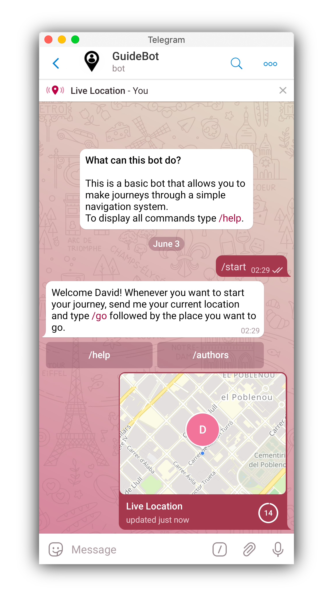
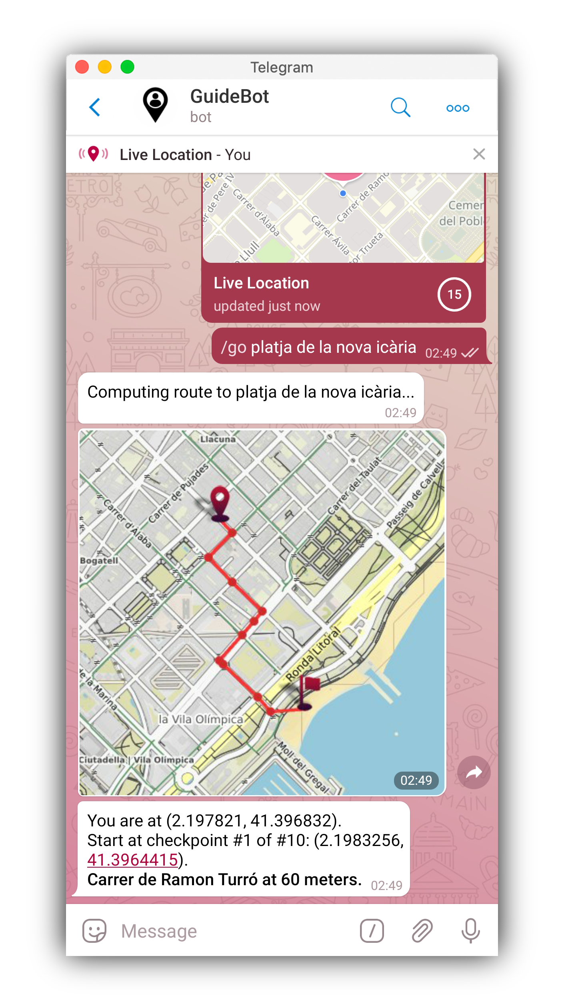
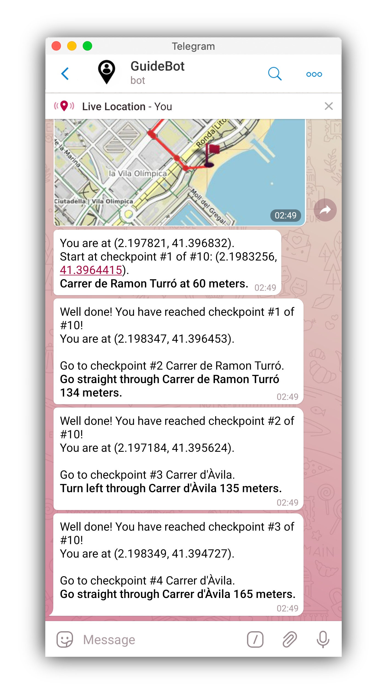
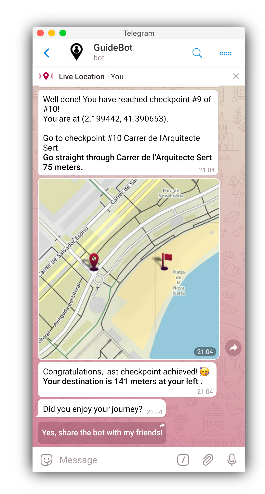
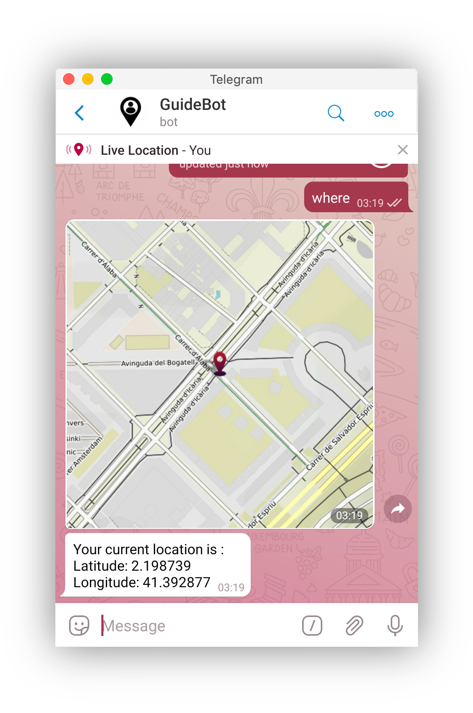
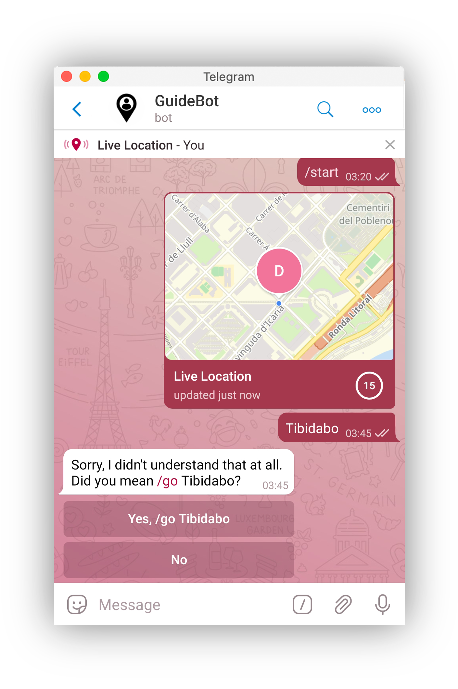
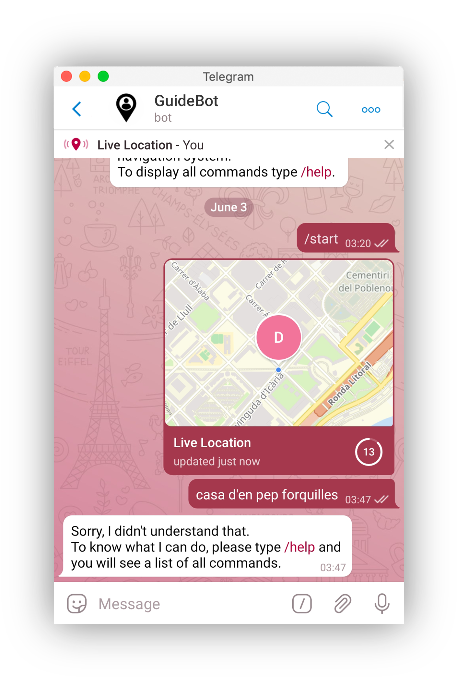
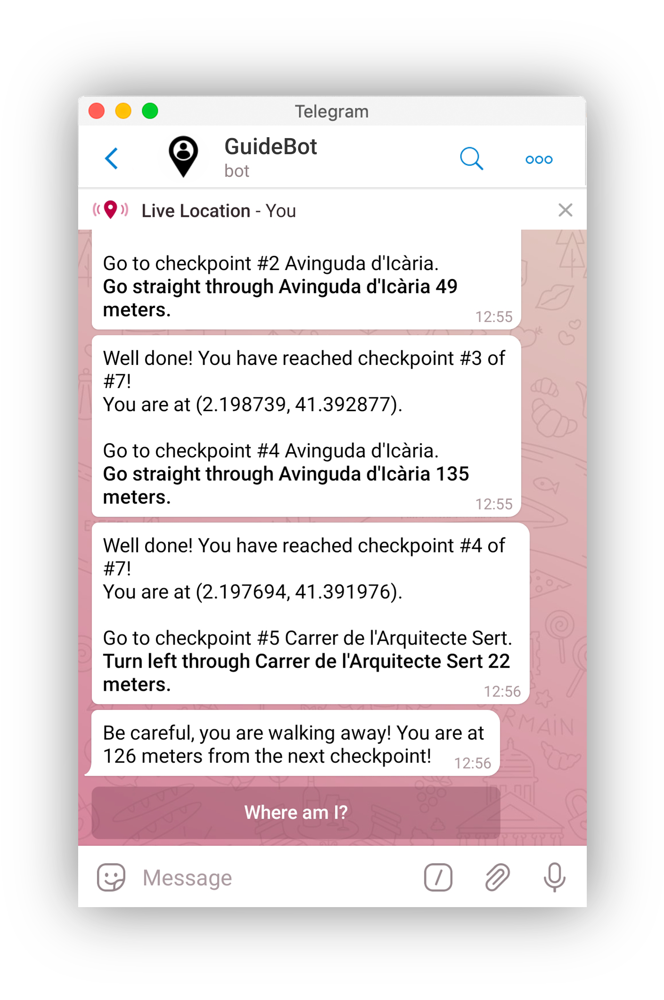
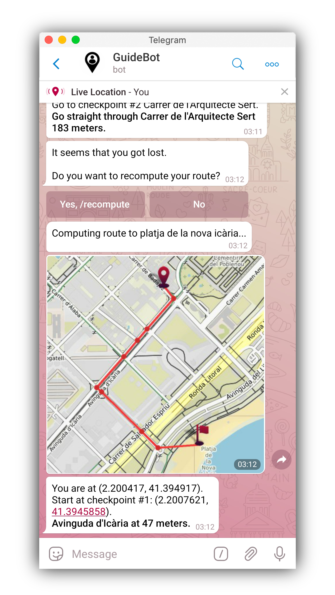
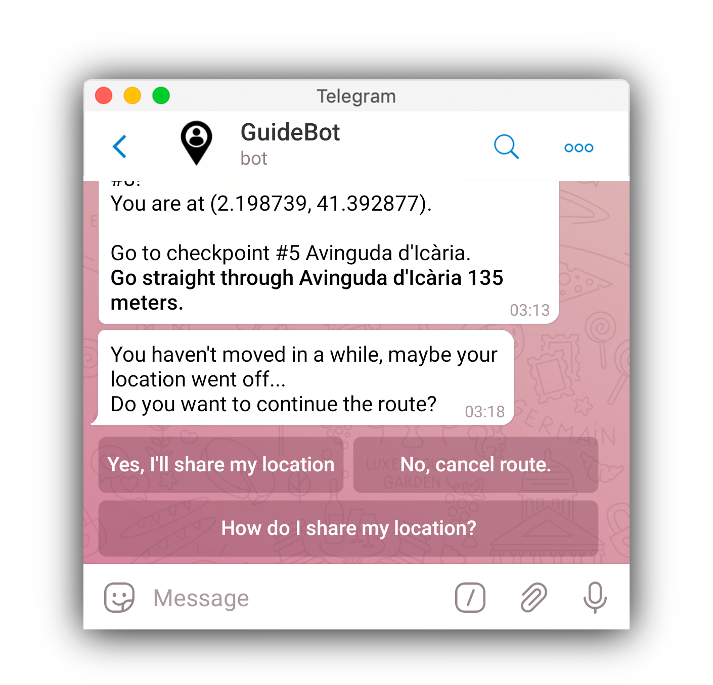

# GuideBot

With this telegram bot, users can be guided when driving to a destination.


This is a telegram bot to guide users where they want to drive within a limited region.

## Getting Started

These instructions will get you a copy of the project up and running on your local machine for development and testing purposes.

### Prerequisites

To install this project you should have installed `pip` in order to install all the packages needed.

### Installing

The `.zip` file contains the following files:

* `bot.py` - The module that interacts with telegram to guide the user.

* `guide.py`- The module that contains everything related to route calculations and maps.

* `requirements.txt` - The file containing all the packages needed.

* `icon-flag.png` - An icon used on `guide.py` that indicates the destiny.

* `icon-location.png` - An icon used on `guide.py` that indicates the user location.

* `README.md` - The documentation file.

* `example-images` - Images used on `README.md`.

Now let's see how to install all the packages.  
The `osmnx` library usually gives problems, so here are many ways to install it:

* [install-osmnx-conda](https://anaconda.org/conda-forge/osmnx). If you use anaconda.

* [install-osmnx-pip](https://pypi.org/project/osmnx/). If you have all `osmnx` dependencies.

* If you don't use anaconda and want to install all `osmnx` dependencies, you would have to install `geopandas` first.  
Follow [this tutorial](https://geoffboeing.com/2014/09/using-geopandas-windows/) to see how, then you can install `osmnx` with pip.

To install the other packages needed in this project use the next command on the terminal being at the same directory of `requirements.txt`.

```
$ pip install -r requirements.txt
```

You may create a `virtualenv` to execute this project, to know more about how to install and create virtualenvs visit [virtualenv](https://docs.python.org/3/library/venv.html).


## Introducing to guide.py

This module is the core of our bot. Is responsible of calculating efficient routes and working with graphs of places and map plots.  
Here you have an explanation of the main functions included in `guide.py`

##### **download_graph(place)**

Download a graph from any place of the world where you could drive.

```python
G = guide.download_graph("Barcelona")
```

##### **save_graph(graph, filename)**

Save a graph in a file with pickle format on your system directory.
```python
guide.save_graph(G, "Barcelona-Graph")
```

##### **load_graph(filename)**

Load a graph from a pickle file from your system directory.
```python
G = guide.load_graph("Barcelona-Graph")
```

##### **current_location(location)**

Generate a `.png` image containing a map with a marker on the location.  
Returns the name of the file.
```python
location = (41.40674136015038, 2.1738860390977446)
file = guide.current_location(location)
open(file, 'rb')
```

##### **get_directions(graph, source_location, destination_location)**

Compute the shortest route from source to destiny on the graph, where location and destiny are tuples of (lat,lon) coordinates.  
Source and destiny have to be inside the bounds of the graph.
```python
source = (41.40674136015038, 2.1738860390977446)
destination = (41.4034789, 2.1744103330097055)
route = guide.get_directions(G, source, destination)
print(route)
```

##### **plot_directions(graph, source_location, destination_location, directions, filename, width=400, height=400)**

Plot the directions from source to destination on a map.  
Saves the plot on a `.png` image on system directory and returns the name of the image containing it.
```python
source = (41.40674136015038, 2.1738860390977446)
destination = (41.4034789, 2.1744103330097055)
route = guide.get_directions(G, source, destination)
file = plot_directions(G, source, destination, route, "map")
photo = open(file, 'rb')
```

## Introducing to bot.py

This module is in charge of establishing communication with the telegram user. Through commands, our bot interacts with the user in so many ways.  
To sum up, its job is to generate routes and give indications to the user.

### Commands

Here you have an explanation of the commands that the bot incorporate.

##### **/start**

Start the conversation with the bot, it does a simple introduction.
It is necessary to start the bot with this command.

##### **/help**

Show the user all the commands and functionalities of the bot. Also the user can ask how to share the location on real-time.

##### **/where**

Send a photo of the current location of the user on a map.

##### **/go _place_**

Start a new route to the mentioned place. The user will receive indications during its trip as long as it hasn't arrived to its destination.

##### **/recompute**

Recompute the route to the last place the user was going. The user must have been started a route on any time.
It's useful when the user gets lost.

##### **/cancel**

Cancel the current route of the user. The destination will remain saved as long as the user don't start a new different route.
It's made this way in case the user wants to recompute the previous route.

##### **/author**

Show the authors of this project.

### How the user would use the bot?

Once he enters on the chat, the user has to share its location on real-time.  
Then he types /go place, being `place` where he wants to go.
The bot computes the route and sends an image with the journey. The bot tells the user how to follow the route to reach the destination.
The user has to go through checkpoints to reach its desitination, with the help of the indications the bot give.
Once a checkpoint is reached, he has to go to the next checkpoint... until the route ends.

Here is an example, the user wants to go to "Platja de la nova Icària" from "Carrer de Badajoz, 56"

<span>




</span>

### Features

##### **User-friendly**

In order to make the communication with the bot faster and less tedious to the user, some awesome features are incorporated.

First, each command is adapted so that they can be used without putting the counterbar `/` in front of them.
The `/go` command is also adapted to detect if the user wants to go anywhere just by messaging the place.
If the place doesn't exist, the bot won't understand the message and would tell the user.  

Another remarkable feature is that inline buttons are added in some cases. They improve the user experience when interacting with the bot.
It gives the user the possibility to choose what to do when some situations happen.  
<span>




</span>

##### **For whom skip nodes of the route**

This feature is essential to verify that the user is following the route. The bot acts accordingly if the user skips some checkpoints.

##### **Recomputing route**

Very useful if the user is lost or simply wants to recompute the route on his own whenever he wants.
Just by pressing `/recompute`, the bot computes a new route to the previous destination place.
The bot also gives this option if the user is getting far away from its route.

<span></span>

##### **Reminder**

When the user stops sharing its location on real-time or doesn't move for few minutes, the bot will remind the user to share its location.
It also gives the option to `/cancel` the route or ask how to share the location on real-time.

<span></span>

## Customization

This section explains various options to customize both modules `guide.py` and `bot.py`.

### guide.py

##### Icons

The icons shown at the photos on the functions `current_location`and `plot_directions` are customizable.
This means you can use your own icons as long as they follow the appropriate format `.png`.
For better appareance, it is recommended to use transparent background on the icons.

<span>


</span>

##### Changeable constants

* FIND_DST: The radius used to look for the nearest edge when optimizing the route.

* FARTHEST_NODE: The maximum distance to consider a node out of the graph.

> Note: You can modify this constants (on top of the code) being aware of its consequences.

### bot.py

##### Map

You can choose in which zone the bot would work. This is done by changing the graph.
By default, the zone is "Barcelona". It can be changed by changing the proper constant.

##### Changing constants

* PLACE: The region the bot is guiding through. The user will be informed about that region.

* NEAR_DST: The maximum distance to consider the user is near a checkpoint.

* AWAY_DST: The minimum distance to consider the user may be getting lost from its route.

* FAR_AWAY_DST: The minimum distance to consider the user got lost from its route.

* MAX_TIME: The time to consider the user is not sharing its location anymore.

* N: The number of checkpoints the user can skip to make sure the route continues.

> Note: You can modify this constants (on top of the code) being aware of its consequences.

## Tested using

* [OpenStreetMap](https://www.openstreetmap.org/) - The web used to see places, routes and coordinates.
* [GPS-Simulator](https://play.google.com/store/apps/details?id=com.rosteam.gpsemulator) - A tool to simulate a locations on phones.

## Authors

* Dani Gomez

* David Pujalte